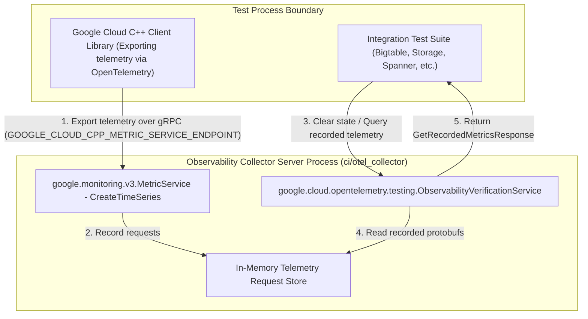
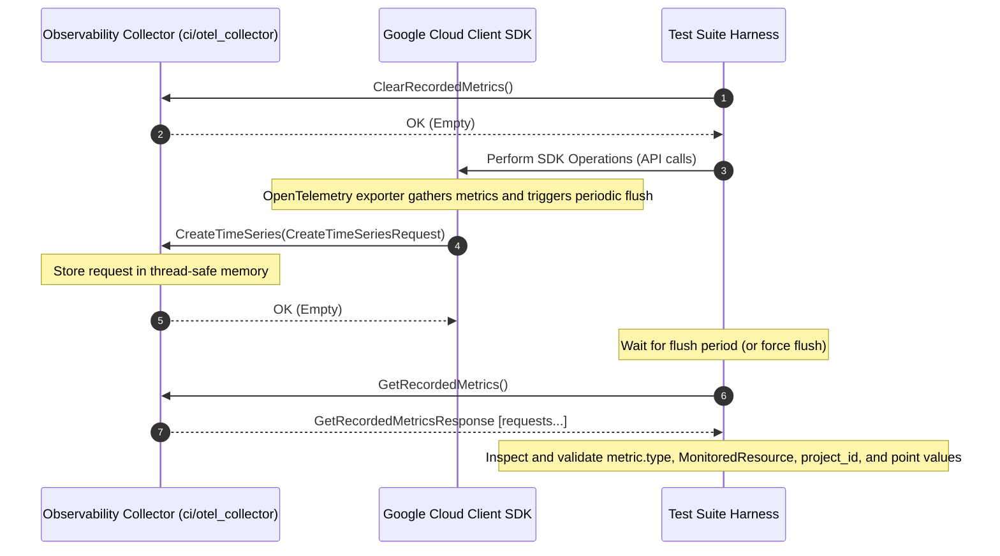

# Architectural Design: Observability Collector Server

## 1. Objective

Provide a generalized design for an in-process and out-of-process fake gRPC
server to intercept, store, and verify OpenTelemetry / Cloud Monitoring and
Cloud Trace RPCs sent by any `google-cloud-cpp` client library (e.g., Bigtable,
Storage, Spanner, PubSub) during integration and system testing.

______________________________________________________________________

## 2. Background & Rationale

Multiple `google-cloud-cpp` client libraries export low-level transport and
client-side performance telemetry (metrics and traces) to Google Cloud
Observability backends via OpenTelemetry. While unit testing with in-process
mocks validates component logic, integration tests require verifying the
end-to-end telemetry pipeline across gRPC transports.

By establishing a shared **Observability Collector Server** under internal CI
tooling infrastructure (`ci/otel_collector`):

- **Separation of Customer vs Testing Code**: Keeps internal mock servers, test
  binaries, and CI helper code inside `ci/` and out of customer-facing
  header/library directories (`google/cloud/`).
- **Reusability Across All Libraries**: A single utility under `ci/` serves
  Bigtable, Storage, Spanner, PubSub, and future SDK components exporting
  telemetry.
- **Complete End-to-End Transport Coverage**: Verifies gRPC OpenTelemetry plugin
  registration, batching readers/processors, protobuf serialization, and network
  dispatch.
- **Process & Container Decoupled Testing**: Can be embedded into integration
  test binaries or built as a standalone binary/container
  (`ci/otel_collector_main`) for multi-language system testing.
- **Hermetic Test Execution**: Standardized verification RPCs enable resetting
  server state between test cases to prevent telemetry pollution across tests.
- **Unified Observability Architecture**: Supports metric verification
  (`GetRecordedMetrics`) and is architected to seamlessly accommodate trace
  verification (`GetRecordedTraces`) in a single server framework.

______________________________________________________________________

## 3. System Architecture

The server hosts multiple gRPC service interfaces on a single listening port:

1. **`google.monitoring.v3.MetricService`**: Standard Cloud Monitoring API
   endpoint that receives `CreateTimeSeries` requests.
1. **`google.devtools.cloudtrace.v2.TraceService`**: Standard Cloud Trace API
   endpoint receiving trace spans (future extension).
1. **`google.cloud.opentelemetry.testing.ObservabilityVerificationService`**:
   Shared control-plane interface used by test suites to inspect and manage
   captured metric and trace protobufs.

### Architecture Overview



______________________________________________________________________

## 4. Service Contracts & Protobuf Specification

### 4.1 Imported Services

Standard Google Cloud Observability proto definitions:

- `google/monitoring/v3/metric_service.proto`
- `google/devtools/cloudtrace/v2/tracing.proto` (optional/future)

### 4.2 Generic Control-Plane Proto Schema (`protos/google/cloud/opentelemetry/testing/observability_verification.proto`)

```protobuf
syntax = "proto3";

package google.cloud.opentelemetry.testing;

import "google/monitoring/v3/metric_service.proto";
import "google/protobuf/empty.proto";

// Response containing all captured CreateTimeSeriesRequest protobuf messages.
message GetRecordedMetricsResponse {
  repeated google.monitoring.v3.CreateTimeSeriesRequest requests = 1;
}

// Control-plane service for test harnesses to query and manage captured observability telemetry.
service ObservabilityVerificationService {
  // Returns all CreateTimeSeriesRequests captured since the last reset.
  rpc GetRecordedMetrics(google.protobuf.Empty)
      returns (GetRecordedMetricsResponse);

  // Resets the server metric state by clearing all recorded metric requests.
  rpc ClearRecordedMetrics(google.protobuf.Empty)
      returns (google.protobuf.Empty);
}
```

______________________________________________________________________

## 5. Sequence Diagram: Generic Integration Test Lifecycle



______________________________________________________________________

## 6. Implementation & Directory Layout

### 6.1 Repository Directory Layout

To keep internal test infrastructure strictly separate from customer-facing
headers and libraries:

- **Protobuf Schema**:
  `protos/google/cloud/opentelemetry/testing/observability_verification.proto`
- **C++ Implementation Header**: `ci/otel_collector/otel_collector.h`
- **C++ Implementation Source**: `ci/otel_collector/otel_collector.cc`
- **Standalone Server Binary Main**: `ci/otel_collector/otel_collector_main.cc`
- **Build Targets (CMake / Bazel)**: Internal target defined under
  `ci/otel_collector/CMakeLists.txt` (not installed or exposed in public SDK
  distribution packages).

### 6.2 C++ Fake Server Implementation (`google::cloud::testing_util`)

```cpp
#include "protos/google/cloud/opentelemetry/testing/observability_verification.grpc.pb.h"
#include <google/monitoring/v3/metric_service.grpc.pb.h>
#include <grpcpp/grpcpp.h>
#include <mutex>
#include <vector>

namespace google {
namespace cloud {
namespace testing_util {

class OtelCollectorServer final
    : public google::monitoring::v3::MetricService::Service,
      public google::cloud::opentelemetry::testing::ObservabilityVerificationService::Service {
 public:
  // --- MetricService Interface ---
  grpc::Status CreateTimeSeries(
      grpc::ServerContext* /*context*/,
      google::monitoring::v3::CreateTimeSeriesRequest const* request,
      google::protobuf::Empty* /*response*/) override {
    std::lock_guard<std::mutex> lock(mu_);
    metric_requests_.push_back(*request);
    return grpc::Status::OK;
  }

  // --- ObservabilityVerificationService Interface ---
  grpc::Status GetRecordedMetrics(
      grpc::ServerContext* /*context*/,
      google::protobuf::Empty const* /*request*/,
      google::cloud::opentelemetry::testing::GetRecordedMetricsResponse* response) override {
    std::lock_guard<std::mutex> lock(mu_);
    for (auto const& req : metric_requests_) {
      *response->add_requests() = req;
    }
    return grpc::Status::OK;
  }

  grpc::Status ClearRecordedMetrics(
      grpc::ServerContext* /*context*/,
      google::protobuf::Empty const* /*request*/,
      google::protobuf::Empty* /*response*/) override {
    std::lock_guard<std::mutex> lock(mu_);
    metric_requests_.clear();
    return grpc::Status::OK;
  }

 private:
  std::mutex mu_;
  std::vector<google::monitoring::v3::CreateTimeSeriesRequest> metric_requests_;
};

}  // namespace testing_util
}  // namespace cloud
}  // namespace google
```

______________________________________________________________________

## 7. Generic Client Verification Matrix

Integration tests across different libraries can reuse
`ObservabilityVerificationService` to validate service-specific observability
contracts:

| Library      | Sample Target Metric Types                                                 | Key MonitoredResource Labels to Assert                         |
| :----------- | :------------------------------------------------------------------------- | :------------------------------------------------------------- |
| **Bigtable** | `grpc.client.attempt.duration`, `grpc.subchannel.open_connections`         | `project_id`, `instance`, `app_profile`, `client_name`, `uuid` |
| **Storage**  | `storage.googleapis.com/client/throughput`, `grpc.client.attempt.duration` | `project_id`, `bucket_name`, `client_name`                     |
| **Spanner**  | `spanner.googleapis.com/client/session_pool/active_count`                  | `project_id`, `instance_id`, `database_id`                     |
| **PubSub**   | `pubsub.googleapis.com/client/published_message_count`                     | `project_id`, `topic_id`                                       |

______________________________________________________________________

## 8. Extensibility & Future Expansion

1. **Trace Verification Integration**: The `ObservabilityVerificationService`
   control plane can be extended with
   `google.devtools.cloudtrace.v2.TraceService` implementation and corresponding
   methods:
   - `rpc GetRecordedTraces(google.protobuf.Empty) returns (GetRecordedTracesResponse)`
   - `rpc ClearRecordedTraces(google.protobuf.Empty) returns (google.protobuf.Empty)`
1. **Error Injection API**: Add `SetCreateTimeSeriesStatus(grpc::Status status)`
   to simulate transient backend failures and test SDK fallback/retry behavior.
1. **Reactive Verification**: Support streaming RPCs or server push
   notifications when expected telemetry points are recorded to accelerate
   integration test execution without arbitrary `sleep` timeouts.
