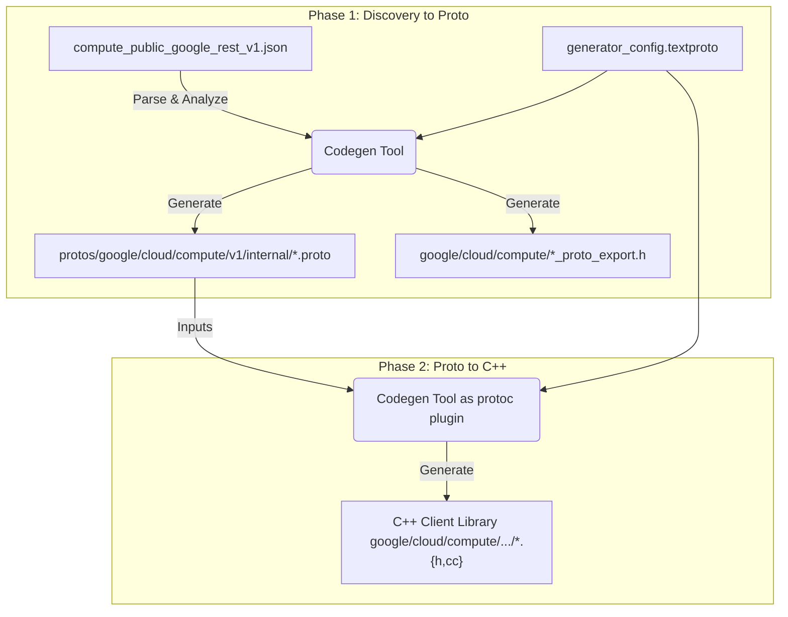
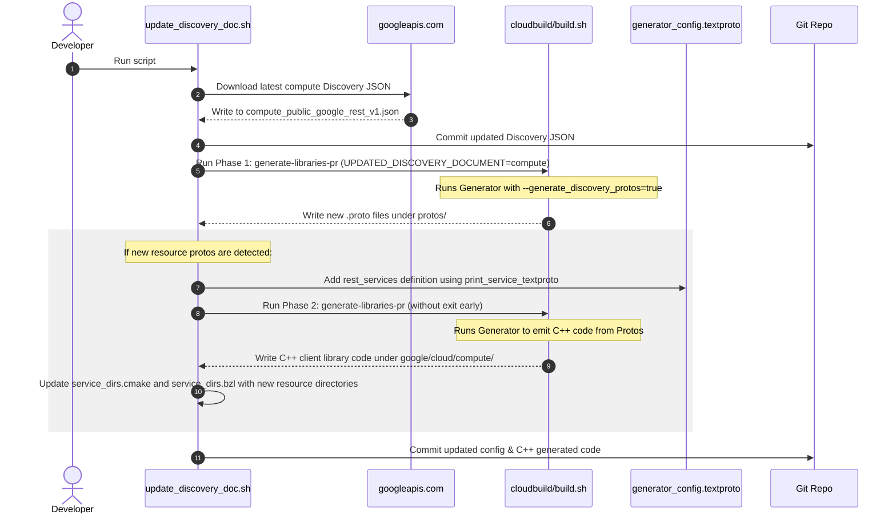

# Architecture: Compute Library Generation Pipeline

This document explains the architecture and process used to generate C++ client
libraries for Google Compute Engine in `google-cloud-cpp` using the Discovery
Document `compute_public_google_rest_v1.json`.

## Overview

Unlike most Google Cloud services that use gRPC and have official Protobuf
(`.proto`) service definitions, Google Compute Engine is a REST-only service
defined via a Google API Discovery Document.

Since the `google-cloud-cpp` generator (the C++ micro-generator) is built on top
of Protobuf definitions, generating C++ code directly from REST Discovery JSON
is not possible. To bridge this gap, the team implemented a **two-phase
generation pipeline**:

______________________________________________________________________

## Phase 1: Discovery to Proto (REST to Proto Translation)

The first phase translates the REST Discovery JSON document into Protobuf
definitions (`.proto` files).

### Key Components

- **Discovery Document**:
  [discovery/compute_public_google_rest_v1.json](discovery/compute_public_google_rest_v1.json)
  Contains all REST schema and resource definitions.
- **Generator Configuration**:
  [generator_config.textproto](generator_config.textproto) Contains a
  `discovery_products` section that specifies the JSON file URL, operations
  mappings, and service details.
- **Generation Tool**: `//generator:google-cloud-cpp-codegen` run with
  `--generate_discovery_protos=true`.

### Process

1. **Parse JSON & Extract Schemas**: The tool parses
   `compute_public_google_rest_v1.json` and converts its `schemas` section into
   `DiscoveryTypeVertex` graph nodes.
1. **Resource Extraction**: It parses the `resources` section into
   `DiscoveryResource` representation (methods, path templates, etc.).
1. **Request/Response Synthesis**: In REST, method parameters are mapped to URI
   path segments and query parameters. Protobuf, however, expects a single
   request message. The tool synthesizes a request message for every REST method
   (e.g. `GetAddressRequest` grouping `project`, `region`, `address` path
   parameters and `fields` query parameters).
1. **Dependency Analysis**: The tool traverses the `DiscoveryTypeVertex`
   dependency graph to establish which types need to import others (i.e. to
   generate correct `.proto` `import` statements).
1. **Partitioning and common files**: Since Compute has thousands of types,
   dumping them in one file is impractical.
   - Types unique to a resource are generated inside that resource's `.proto`
     file.
   - Types shared across multiple resources are grouped into sequential common
     files (e.g., `google/cloud/compute/v1/internal/common_000.proto`,
     `common_001.proto`).
1. **Writing Output**:
   - Generates `.proto` files inside `protos/google/cloud/compute/v1/internal/`.
   - Generates C++ export headers (`*_proto_export.h`) in public headers
     directory (e.g.
     `google/cloud/compute/addresses/v1/addresses_proto_export.h`). These
     headers contain `IWYU pragma: export` directives targeting the C++ headers
     compiled from `common_xxx.proto`, offering a cleaner public API without
     leaking internal file layout.

______________________________________________________________________

## Phase 2: Proto to C++ (C++ Code Generation)

In this phase, the generated `.proto` files are processed just like regular
protobufs from `googleapis` to generate the C++ client libraries.

### Key Components

- **Generated Protos**: The outputs of Phase 1 in
  `protos/google/cloud/compute/v1/internal/`.
- **Generator Configuration**:
  [generator_config.textproto](generator_config.textproto) In this phase, the
  `rest_services` targets within `discovery_products` are processed.
- **Generation Tool**: `//generator:google-cloud-cpp-codegen` run without
  `--generate_discovery_protos`. Under the hood, this compiles the generator
  code as a `protoc` plugin (`google-cloud-cpp-codegen`) and runs it.

### Process

1. The generator parses the `.proto` files using protobuf's
   CommandLineInterface.
1. For each configured service (e.g. `Addresses`), it generates:
   - Public client interface (`addresses_client.h`, `addresses_client.cc`).
   - Public connection interface (`addresses_connection.h`,
     `addresses_connection.cc`).
   - Internal stubs and decorators (`internal/addresses_rest_stub.h`,
     `internal/addresses_rest_stub.cc`,
     `internal/addresses_rest_metadata_decorator.cc`, etc.).
   - Mocks (`mocks/mock_addresses_connection.h`).
1. Because `generator_config.textproto` configures these services with
   `generate_rest_transport: true` and `generate_grpc_transport: false`, the
   generator emits REST-based stubs (`AddressesRestStub` using
   `google::cloud::rest_internal::RestClient`) instead of gRPC stubs.

______________________________________________________________________

## Orchestration: `update_discovery_doc.sh`

The transition between these phases is managed by the shell script
[discovery/update_discovery_doc.sh](discovery/update_discovery_doc.sh).

When a developer runs this script:

1. It pulls the latest discovery document from the web.
1. It runs the build system in Cloud Build (`generate-libraries-pr`) with
   `UPDATED_DISCOVERY_DOCUMENT=compute`. This invokes
   `ci/cloudbuild/builds/generate-libraries.sh`, which performs **Phase 1** and
   writes the updated `.proto` files, then exits early.
1. If new `.proto` files are detected:
   - It dynamically updates `generator/generator_config.textproto` to add a new
     `rest_services` entry for the new services.
   - It re-runs the generator build, this time executing **Phase 2** to generate
     the actual C++ client code.
   - It inserts the new directories into C++ CMake and Bazel lists
     (`google/cloud/compute/service_dirs.cmake` and
     `google/cloud/compute/service_dirs.bzl`).
1. It commits both the hand-crafted configuration updates and all generated code
   (protos, C++ code).
