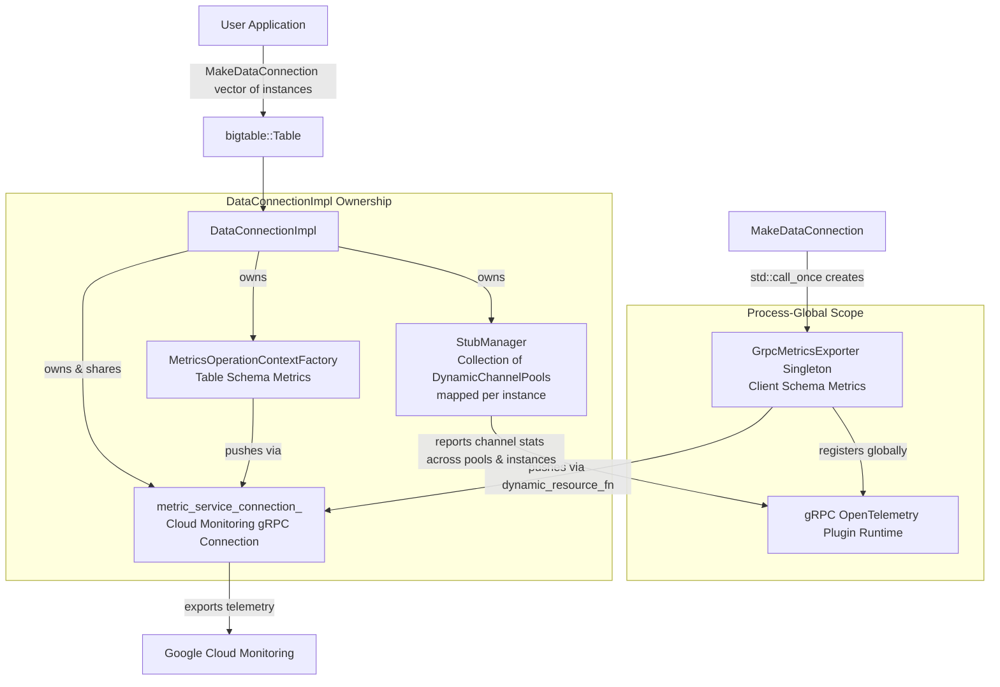

# Objective

Enable the onboarding of a $XXM/yr customer workload that requires deep visibility into gRPC performance by exporting standard gRPC client metrics (HTTP/2 channel health, load balancing, and connection-level latency) from Cloud Bigtable C++ client applications to Google Cloud Monitoring.

**Out of scope:** Modifying the existing "table schema" (client-side operation latency and attempt) metrics; exporting metrics for administrative APIs (`BigtableTableAdminClient`, `BigtableInstanceAdminClient`); supporting custom non-OpenTelemetry metric backends; supporting the deprecated `MakeDataConnection(Options)` overload.

# Background

The Cloud Bigtable C++ client library currently exports "table schema" metrics (e.g., `OperationLatency`, `AttemptLatency`, `RetryCount`) via `MetricsOperationContextFactory` in [operation_context_factory.cc](https://github.com/googleapis/google-cloud-cpp/tree/v3.6.0/google/cloud/bigtable/internal/operation_context_factory.cc). These metrics are scoped to individual RPC attempts and dynamically determine `project_id`, `instance`, `table`, `cluster`, and `zone` labels per request from table resource names. However, they do not capture low-level gRPC transport behavior such as Weighted Round Robin (WRR) routing, xDS client health, routing lookup service (RLS) cache performance, or raw compressed message sizes.

High-throughput and latency-sensitive Bigtable workloads require visibility into underlying channel health, connection pooling, and payload sizes to troubleshoot network bottlenecks and load balancing efficiency.

**Existing solutions:** The Google Cloud Storage C++ client library implemented gRPC metrics export in [metrics_exporter_impl.h](https://github.com/googleapis/google-cloud-cpp/tree/v3.6.0/google/cloud/storage/internal/grpc/metrics_exporter_impl.h) and [metrics_exporter_impl.cc](https://github.com/googleapis/google-cloud-cpp/tree/v3.6.0/google/cloud/storage/internal/grpc/metrics_exporter_impl.cc). It configures OpenTelemetry views for gRPC histograms (`grpc.client.attempt.duration`, etc.) and registers an OpenTelemetry plugin globally in gRPC via `grpc::OpenTelemetryPluginBuilder().BuildAndRegisterGlobal()`. However, Storage uses a static `MonitoredResource` because each client connects to a single project/resource, whereas Bigtable's preferred `MakeDataConnection` accepts a vector of `InstanceResource` objects, where the `StubManager` maintains a collection of `DynamicChannelPool` objects (each managing one or more gRPC connections) mapped to each target instance.

# Requirements

### Functional Requirements
* **Strict Requirement:** Must create a new class (e.g., `bigtable_internal::GrpcMetricsExporter`) to encapsulate gRPC OpenTelemetry meter provider initialization and global plugin registration.
* **Strict Requirement:** `GrpcMetricsExporter` must be managed as a process-global static singleton when created via `MakeDataConnection`. Because gRPC plugin registration (`grpc::OpenTelemetryPluginBuilder().BuildAndRegisterGlobal()`) is process-global, destroying a `MeterProvider` on connection destruction would shut down the OpenTelemetry export pipeline for all connections in the process. `DataConnectionImpl` accepts a `GrpcMetricsExporter` pointer for flexibility, but receives `nullptr` when using the process-global singleton.
* **Strict Requirement:** Must only be available when the preferred `MakeDataConnection(std::vector<InstanceResource> instances, Options options)` is called (or when `InstanceChannelAffinityOption` is present). If the deprecated `MakeDataConnection(Options)` is called without instance channel affinity, gRPC metrics export is disabled.
* **Strict Requirement:** Because `MakeDataConnection` accepts a vector of `InstanceResource` objects (creating a multi-instance connection pool), the exporter must export metrics for all of these instances and their underlying channels.
* **Strict Requirement:** Given this one-to-many cardinality, the `MonitoredResource` must NOT be static. Instead, it must be dynamically populated from metric data attributes received from gRPC by populating client schema labels (`project_id`, `instance`, `app_profile`, `client_name`, and `uuid`), falling back to `InstanceChannelAffinityOption` for `project_id` if missing from attributes.
* **Strict Requirement:** Must reuse the existing `metric_service_connection_` (of type `std::shared_ptr<monitoring_v3::MetricServiceConnection>`) passed from `MakeDataConnection` rather than opening a second connection to Cloud Monitoring.
* **Strict Requirement:** Must export the following exact gRPC metrics:
  * `grpc.client.attempt.duration`
  * `grpc.lb.rls.default_target_picks`
  * `grpc.lb.rls.target_picks`
  * `grpc.lb.rls.failed_picks`
  * `grpc.xds_client.server_failure`
  * `grpc.xds_client.resource_updates_invalid`
  * `grpc.subchannel.disconnections`
  * `grpc.subchannel.connection_attempts_succeeded`
  * `grpc.subchannel.connection_attempts_failed`
  * `grpc.subchannel.open_connections`
* **Strict Requirement:** Must filter gRPC metrics to target methods starting with `google.bigtable.v2`.
* **Strict Requirement:** Comprehensive testing capabilities must be provided, including unit tests for meter provider/resource creation and end-to-end integration tests using an in-process mock collector server for DirectPath and standard metric verification.

### Non-Functional Requirements
* **Strict Requirement:** Must not duplicate global gRPC plugin registrations or terminate OpenTelemetry export pipelines when multiple `DataConnectionImpl` instances are instantiated or destroyed in the same process.
* **Strict Requirement:** Must have negligible CPU and memory overhead and adhere to the configured metric export period (`bigtable::MetricsPeriodOption`).
* **Strict Requirement:** Must not break existing table schema metrics or alter `OperationContextFactory` behavior.

# Overview

We introduce `bigtable_internal::GrpcMetricsExporter`, which encapsulates gRPC OpenTelemetry meter provider initialization, metric filtering, and global gRPC plugin registration.

Because `MakeDataConnection` manages connections across multiple Bigtable instances, `GrpcMetricsExporter` cannot use a static `MonitoredResource`. Instead, it passes a dynamic callback (`MonitoredResourceFromDataFn`) to `otel::MakeMonitoringExporter`. When OpenTelemetry exports metric points received from gRPC, this callback inspects metric data attributes to dynamically extract and populate the required client schema labels (`project_id`, `instance`, `app_profile`, `client_name`, `uuid`) on the `MonitoredResource`.

To safely interface with gRPC's process-wide plugin registry (`grpc::OpenTelemetryPluginBuilder().BuildAndRegisterGlobal()`), `GrpcMetricsExporter` instances are shared across active connection instances via `GrpcMetricsExporterRegistry::Singleton()`. A thread-safe registry maintains `std::weak_ptr<GrpcMetricsExporter>` references per channel authority, ensuring that the gRPC OpenTelemetry plugin is registered once for active connections while complying with Google C++ Style Guide rules against static non-trivially destructible objects. When all connection instances using an exporter are destroyed, `MeterProvider::Shutdown()` is cleanly invoked.

# Detailed Design

## Dynamic Client Schema Monitored Resource (One-to-Many Cardinality)
Because `MakeDataConnection(std::vector<InstanceResource>, ...)` configures connection pools across multiple target instances, a static `MonitoredResource` with a single fixed `project_id` and `instance` cannot be used. Instead, `GrpcMetricsExporter` passes a `MonitoredResourceFromDataFn` (`dynamic_resource_fn`) callback to `otel::MakeMonitoringExporter`.

When OpenTelemetry exports metric points received from gRPC across any of the underlying `DynamicChannelPool` connections, `dynamic_resource_fn` inspects `pda.attributes` (the PointDataAttributes received from gRPC) to dynamically extract and populate the required client schema labels on the `MonitoredResource`:
* `project_id`: Extracted dynamically from gRPC metric attributes (`project_id`). If absent, falls back to resolving `project_id` from `InstanceChannelAffinityOption`.
* `instance`: Extracted dynamically from gRPC metric attributes (`instance`).
* `app_profile`: Populated from `options.get<bigtable::AppProfileIdOption>()`.
* `client_name`: Populated as `"cpp.Bigtable/" + version_string()`.
* `uuid`: Populated from the unique connection ID (reusing `client_uid` from `DataConnectionImpl`).

A corresponding `resource_filter_fn` is provided to ensure `project_id` and `instance` are filtered from metric point labels so they are not duplicated against `MonitoredResource` labels. Extra gRPC method attributes (`grpc.method`, `grpc.status`) are filtered out of the resource labels.

## gRPC Histogram Views & Metric Enablement
Mirroring `google/cloud/storage/internal/grpc/metrics_meter_provider.cc`, we add custom latency histogram boundary views for `grpc.client.attempt.duration` (with latency boundaries scaled from 0ms up to 5 minutes, tailored for Google Cloud Bigtable RPCs).

When configuring `grpc::OpenTelemetryPluginBuilder`, we explicitly enable the following 10 gRPC metrics:
* `grpc.client.attempt.duration`
* `grpc.lb.rls.default_target_picks`
* `grpc.lb.rls.target_picks`
* `grpc.lb.rls.failed_picks`
* `grpc.xds_client.server_failure`
* `grpc.xds_client.resource_updates_invalid`
* `grpc.subchannel.disconnections`
* `grpc.subchannel.connection_attempts_succeeded`
* `grpc.subchannel.connection_attempts_failed`
* `grpc.subchannel.open_connections`

## Channel Scope & Method Filtering
We configure `grpc::OpenTelemetryPluginBuilder` with:
* **Method Attribute Filter:** Only record metrics where `absl::StartsWith(target, "google.bigtable.v2")`.
* **Channel Scope Filter:** Only monitor channels matching the configured `AuthorityOption` (e.g., `bigtable.googleapis.com` or custom universe domain endpoints).

## Process-Wide Registration & Lifecycle Management
Because `BuildAndRegisterGlobal()` modifies process-global gRPC state, registration lifecycle requires special care:
1. **Singleton Authority Registry:** `GrpcMetricsExporterRegistry` maintains a thread-safe map of active channel authorities to `std::weak_ptr<GrpcMetricsExporter>`. Calling `GetOrCreate(...)` returns an existing shared exporter if active, or creates and registers a new one if none exists.
2. **Reference-Counted Exporter Sharing:** In `MakeDataConnection` (`data_connection.cc`), when `EnableMetricsOption` and `InstanceChannelAffinityOption` are active, `GrpcMetricsExporter` is obtained via `GrpcMetricsExporterRegistry::Singleton().GetOrCreate(...)` and passed as a `std::shared_ptr` to `DataConnectionImpl`. When all `DataConnectionImpl` instances sharing an exporter are destroyed, `~GrpcMetricsExporter()` invokes `MeterProvider::Shutdown()` and unregisters the authority from the registry.

# Testing Capabilities

To ensure robust quality, reliability, and correctness, comprehensive testing capabilities have been implemented across unit testing, integration testing, and CI automation.

### Unit Tests (`grpc_metrics_exporter_test.cc`)
Unit tests validate the internal components of `GrpcMetricsExporter` in isolation:
* **Meter Provider & Histogram Views (`ValidateGrpcClientAttemptDuration`):** Uses a `MockPushMetricExporter` to verify that `grpc.client.attempt.duration` records metrics using `MakeLatencyHistogramBoundaries()`.
* **Monitored Resource Population (`MakeMonitoredResource*`):**
  * Verifies correct client schema label extraction (`project_id`, `instance`, `app_profile`, `client_name`, `uuid`).
  * Tests graceful handling when attributes are missing or partially supplied.
  * Ensures extra gRPC attributes (`grpc.method`, `grpc.status`) are filtered out of resource labels.
* **Histogram Boundaries (`MakeLatencyHistogramBoundaries`):** Asserts boundary ordering, minimum step size (>=1ms), and upper cap (<=300s).
* **Registry Management (`GrpcMetricsExporterRegistryTest`):** Verifies singleton authority registration deduplication and state clearing (`SingletonAndClear`).

### Integration & Observability Verification (`observability_integration_test.cc`)
End-to-end integration tests validate actual metric emission over real gRPC channels and DirectPath:
* **In-Process Mock Collector Server:** `ObservabilityIntegrationTest` spins up an in-memory gRPC server implementing `google::cloud::testing_util::OtelCollectorServer` (hosting both Cloud Monitoring `MetricService` and `ObservabilityVerificationService`).
* **Environment Overrides:** Tests set `GOOGLE_CLOUD_CPP_METRIC_SERVICE_ENDPOINT` (pointing to `localhost:<port>`) and `GOOGLE_CLOUD_CPP_TESTING_OTEL_COLLECTOR=1` to redirect client metric export to the test collector without reaching production Cloud Monitoring endpoints.
* **Table Schema Metric Verification (`VerifyOperationAndAttemptMetrics`):** Verifies that client operation latency and attempt latency time series are properly exported with matching project, instance, and table labels.
* **DirectPath gRPC Metric Verification (`VerifyDirectPathGrpcMetrics`):**
  * Validates gRPC client metrics exported during actual operations over DirectPath (when DirectPath is reachable).
  * Asserts that `workload.googleapis.com/grpc.client.attempt.duration` and `workload.googleapis.com/grpc.client.attempt.started` time series are exported with `workload.googleapis.com/grpc.` prefixes.

### Build Integration & CI Triggers
* **Preprocessor Protection:** Code and tests are guarded by `#ifdef GOOGLE_CLOUD_CPP_BIGTABLE_WITH_GRPC_OTEL_METRICS` in CMake (`CMakeLists.txt`) and Bazel (`BUILD.bazel`).
* **Automated CI:** Dedicated Cloud Build triggers (`ci/cloudbuild/triggers/observability-ci.yaml`) run observability build targets (`_BUILD_NAME: observability`) to prevent regressions.

# Implementation Details

### New Files
* `google/cloud/bigtable/internal/grpc_metrics_exporter.h`: Defines `GrpcMetricsExporter` class, `GrpcMetricsExporterRegistry` singleton, and helper functions (`MakeMonitoredResource`, `MakeLatencyHistogramBoundaries`, `MakeGrpcMeterProvider`).
* `google/cloud/bigtable/internal/grpc_metrics_exporter.cc`: Implements `MakeGrpcMeterProvider`, histogram view configuration, dynamic `MonitoredResourceFromDataFn` construction, registry deduplication, and `grpc::OpenTelemetryPluginBuilder` invocation.
* `google/cloud/bigtable/internal/grpc_metrics_exporter_test.cc`: Unit tests verifying dynamic label extraction, boundary creation, meter provider creation, and registry deduplication.
* `google/cloud/bigtable/tests/observability_integration_test.cc`: End-to-end observability integration tests verifying table schema and DirectPath gRPC metrics export against an in-process mock collector server.

### Modified Files
* `google/cloud/bigtable/data_connection.cc`:
  * In `MakeDataConnection`, when `EnableMetricsOption` is enabled and `InstanceChannelAffinityOption` is present, initializes `GrpcMetricsExporter` as a process-global static singleton via `std::call_once`.
* `google/cloud/bigtable/internal/data_connection_impl.h` & `google/cloud/bigtable/internal/data_connection_impl.cc`:
  * Receives `grpc_metrics_exporter` parameter in constructor (`nullptr` when managed globally by `MakeDataConnection`).
* `google/cloud/bigtable/CMakeLists.txt` & `google/cloud/bigtable/BUILD.bazel`:
  * Added `grpc_metrics_exporter.cc`, `grpc_metrics_exporter.h`, `grpc_metrics_exporter_test.cc`, and `observability_integration_test.cc` to build targets under `GOOGLE_CLOUD_CPP_BIGTABLE_WITH_GRPC_OTEL_METRICS`.
* `ci/cloudbuild/triggers/observability-ci.yaml`:
  * Configured Cloud Build CI trigger for continuous observability verification.

# Alternatives Considered

### Alternative 1: Static MonitoredResource (Storage Pattern)
* **We considered** using a static `MonitoredResourceOption` as done in Storage.
* **We rejected this** because Bigtable's preferred `MakeDataConnection` accepts a vector of `InstanceResource` objects. A static resource cannot represent metrics across multiple target instances; therefore, dynamic population via `MonitoredResourceFromDataFn` inspecting gRPC metric data is required.

### Alternative 2: Connection-Scoped Exporter Lifecycle
* **We considered** binding `GrpcMetricsExporter`'s lifecycle directly to `DataConnectionImpl` as a `std::unique_ptr` member destroyed upon connection close.
* **We rejected this** because destroying `GrpcMetricsExporter` calls `MeterProvider::Shutdown()`. Because gRPC OpenTelemetry plugin registration is process-global (`BuildAndRegisterGlobal()`), shutting down the `MeterProvider` terminates background export for all other active or future connections in the process. We chose a process-global static singleton managed via `std::call_once` in `MakeDataConnection`.

### Alternative 3: Separate Cloud Monitoring Connection for gRPC Metrics
* **We considered** allowing the gRPC metrics exporter to open its own `MetricServiceConnection` independently of `DataConnectionImpl`'s operation metrics.
* **We went with** reusing `metric_service_connection_` because it reduces file descriptor usage, avoids unnecessary TCP/TLS handshakes to Cloud Monitoring, and minimizes resource overhead per client.

# Risks and Mitigation Strategies

### Risk 1: Global gRPC Plugin Lifecycle vs. Client Destruction
* **Risk:** If Client A registers the global gRPC plugin and is later destroyed while Client B (or subsequent operations) are active, destroying Client A's meter provider shuts down the background export pipeline globally and breaks metrics for Client B.
* **Mitigation:** Manage `GrpcMetricsExporter` as a process-global static singleton created via `std::call_once` in `MakeDataConnection`, ensuring the OpenTelemetry meter provider remains alive for the duration of the process.

# Corpus of Information

* [data_connection.cc](file:///usr/local/google/home/sdhart/cloud_cxx4/google-cloud-cpp/google/cloud/bigtable/data_connection.cc)
* [data_connection_impl.h](file:///usr/local/google/home/sdhart/cloud_cxx4/google-cloud-cpp/google/cloud/bigtable/internal/data_connection_impl.h)
* [data_connection_impl.cc](file:///usr/local/google/home/sdhart/cloud_cxx4/google-cloud-cpp/google/cloud/bigtable/internal/data_connection_impl.cc)
* [grpc_metrics_exporter.h](file:///usr/local/google/home/sdhart/cloud_cxx4/google-cloud-cpp/google/cloud/bigtable/internal/grpc_metrics_exporter.h)
* [grpc_metrics_exporter.cc](file:///usr/local/google/home/sdhart/cloud_cxx4/google-cloud-cpp/google/cloud/bigtable/internal/grpc_metrics_exporter.cc)
* [grpc_metrics_exporter_test.cc](file:///usr/local/google/home/sdhart/cloud_cxx4/google-cloud-cpp/google/cloud/bigtable/internal/grpc_metrics_exporter_test.cc)
* [observability_integration_test.cc](file:///usr/local/google/home/sdhart/cloud_cxx4/google-cloud-cpp/google/cloud/bigtable/tests/observability_integration_test.cc)
