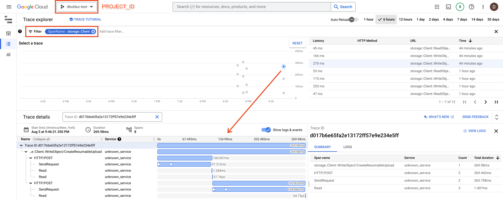

# HOWTO: Google Cloud C++ Client Library + Cloud Trace integration.

This directory contains a small example showing how to enable OpenTelemetry
tracing for a Google Cloud Storage (GCS) client. The traces are collected and
sent to Cloud Trace.

This quickstart assumes the reader is familiar with how to build and use the GCS
client. If not, see the [GCS quickstart][quickstart-storage].

The quickstart also assumes the reader is familiar with how to build the Cloud
Trace C++ client library. If not, see the
[Cloud Trace quickstart][quickstart-trace]. Note, for example, that the Cloud
Trace Exporter requires dependencies on gRPC and Protobuf, which the GCS client
does not.

## The Quickstart

### What it does

The quickstart installs a Cloud Trace [exporter]. It creates a GCS client, with
tracing enabled. The client makes some routine calls, each of which are traced.
Upon exit of the quickstart, the collected traces are sent to Cloud Trace.

### Viewing the trace in Cloud Trace

To find the traces created by this quickstart, we can follow the documentation
to [Find and explore traces]. We can open the Cloud Trace UI in the Google Cloud
project we supplied to the quickstart. We can search using the filter
`SpanName:storage::Client` to find any spans created by the GCS client.



For an overview of the Cloud Trace UI, see: [Find and explore traces].

## OpenTelemetry Dependency

The Google Cloud C++ client libraries use [OpenTelemetry] to provide
observability into their operation at runtime. To enable tracing,
`google-cloud-cpp` takes a direct dependency on
[`opentelemetry-cpp`][opentelemetry-cpp].

OpenTelemetry provides full [install instructions][opentelemetry-cpp-install].
We will highlight the important points.

### Compatibility with Abseil

OpenTelemetry vendors-in Abseil types, defining them in `namespace absl`. The
Google Cloud client libraries depends on Abseil, which also defines these types
in the same namespace. In order to avoid ambiguous symbols, we must set certain
flags when compiling `opentelemetry-cpp`.

## Using with Bazel

> :warning: If you are using Windows or macOS there are additional instructions
> at the end of this document.

1. Install Bazel using [the instructions][bazel-install] from the `bazel.build`
   website.

1. Compile this example using Bazel:

   ```bash
   cd $HOME/google-cloud-cpp/google/cloud/opentelemetry/quickstart
   bazel build ...
   ```

   Note that Bazel automatically downloads and compiles all dependencies of the
   project. As it is often the case with C++ libraries, compiling these
   dependencies may take several minutes.

1. Run the example, changing the placeholders to appropriate values:

   ```bash
   bazel run :quickstart -- [BUCKET_NAME] [PROJECT_ID]
   ```

### Details

Note the following feature flag explicitly set in the `.bazelrc`. This flag
enables OpenTelemetry tracing instrumentation in `google-cloud-cpp`.

```bash
# Enables tracing instrumentation in google-cloud-cpp
build --@google_cloud_cpp//:enable_opentelemetry
```

If you are using an OpenTelemetry version \< v1.16.0, you must also supply the
following flag for compatibility with Abseil. Without this flag, the above
`bazel build ...` command will fail.

```bash
build --@io_opentelemetry_cpp//api:with_abseil
```

Also note that we explicitly load OpenTelemetry's dependencies in the
`WORKSPACE.bazel`.

## Using with CMake

> :warning: If you are using Windows or macOS there are additional instructions
> at the end of this document.

### Building from Source

#### Building `google-cloud-cpp`

The [packaging guide] contains instructions for how to build from source.

The Google Cloud exporters are built as part of the `opentelemetry` feature.
This quickstart also uses the GCS client, from the `storage` feature.

To enable these features, add the following to your CMake configuration command:

```
-DGOOGLE_CLOUD_CPP_ENABLE="storage,opentelemetry"
```

#### Details

We must supply the `-DWITH_ABSEIL=ON` flag when compiling `opentelemetry-cpp`
for compatibility with Abseil.

We must also ensure that the `-DCMAKE_CXX_STANDARD` used to compile
`opentelemetry-cpp` matches the language standard used to compile `abseil-cpp`.

OpenTelemetry defaults the language standard if it is not explicitly set. So it
is good practice to explicitly set the language standard.

While OpenTelemetry supports C++>=11, `google-cloud-cpp` requires C++>=14. So
you can use `-DCMAKE_CXX_STANDARD=14`, `-DCMAKE_CXX_STANDARD=17`, or higher.

### Package Managers

#### [`vcpkg`](https://github.com/Microsoft/vcpkg.git)

1. Install the dependencies for this quickstart:

   ```bash
   cd $HOME/vcpkg
   ./vcpkg install google-cloud-cpp[core,opentelemetry,storage]
   ```

   Note that, as it is often the case with C++ libraries, compiling these
   dependencies may take several minutes.

1. Configure CMake:

   ```bash
   cd $HOME/google-cloud-cpp/google/cloud/opentelemetry/quickstart
   cmake -S . -B .build -DCMAKE_TOOLCHAIN_FILE=$HOME/vcpkg/scripts/buildsystems/vcpkg.cmake
   cmake --build .build
   ```

1. Run the example, changing the placeholder(s) to appropriate values:

   ```bash
   .build/quickstart [BUCKET_NAME] [PROJECT_ID]
   ```

#### Other

We are working on this, but at the moment, no other package managers support
`google-cloud-cpp`'s native integration with Cloud Trace.

## Platform Specific Notes

### macOS

gRPC [requires][grpc-roots-pem-bug] an environment variable to configure the
trust store for SSL certificates, you can download and configure this using:

```bash
curl -Lo roots.pem https://pki.google.com/roots.pem
export GRPC_DEFAULT_SSL_ROOTS_FILE_PATH="$PWD/roots.pem"
```

### Windows

Bazel tends to create very long file names and paths. You may need to use a
short directory to store the build output, such as `c:\b`, and instruct Bazel to
use it via:

```shell
bazel --output_user_root=c:\b build ...
```

gRPC [requires][grpc-roots-pem-bug] an environment variable to configure the
trust store for SSL certificates, you can download and configure this using:

```console
@powershell -NoProfile -ExecutionPolicy unrestricted -Command ^
    (new-object System.Net.WebClient).Downloadfile( ^
        'https://pki.google.com/roots.pem', 'roots.pem')
set GRPC_DEFAULT_SSL_ROOTS_FILE_PATH=%cd%\roots.pem
```

[bazel-install]: https://docs.bazel.build/versions/main/install.html
[exporter]: https://opentelemetry.io/docs/concepts/signals/traces/#trace-exporters
[find and explore traces]: https://cloud.google.com/trace/docs/finding-traces
[grpc-roots-pem-bug]: https://github.com/grpc/grpc/issues/16571
[opentelemetry]: https://opentelemetry.io
[opentelemetry-cpp]: https://github.com/open-telemetry/opentelemetry-cpp
[opentelemetry-cpp-install]: https://github.com/open-telemetry/opentelemetry-cpp/INSTALL.md
[packaging guide]: https://github.com/googleapis/google-cloud-cpp/blob/main/doc/packaging.md
[quickstart-storage]: https://github.com/googleapis/google-cloud-cpp/blob/main/google/cloud/storage/quickstart
[quickstart-trace]: https://github.com/googleapis/google-cloud-cpp/blob/main/google/cloud/trace/quickstart
